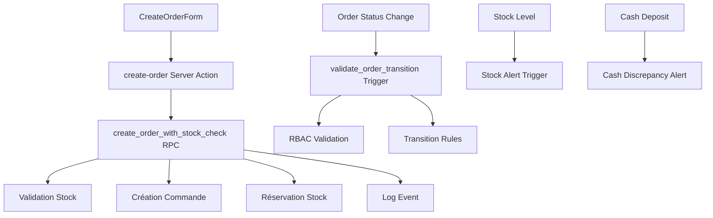

# Plan d'Implémentation - Bloc 2: CRM + Commandes

## État Actuel ✅

### Déjà Implémenté:
- **SQL Schema**: Tables `orders`, `order_items`, `order_events` avec RLS
- **RPC**: `create_order_with_stock_check` avec validation stock atomique
- **Frontend**: Formulaire de création de commande (`CreateOrderForm.tsx`)
- **Server Action**: `create-order.ts` pour l'appel RPC
- **Numérotation**: Format `SHEVA-CMD-YYYY-XXXXX` automatique

## Travail Restant 🚧

### 1. Configuration des Seuils (`tenant_settings`)

**Migration SQL à créer:**
```sql
CREATE TABLE public.tenant_settings (
    tenant_id UUID PRIMARY KEY REFERENCES public.tenants(id),
    cash_discrepancy_threshold NUMERIC(15,2) DEFAULT 500,
    stock_alert_threshold INTEGER DEFAULT 10,
    cash_deposit_warning_hours INTEGER DEFAULT 24,
    cash_deposit_critical_hours INTEGER DEFAULT 48,
    max_cash_per_driver NUMERIC(15,2) DEFAULT 200000,
    max_orders_per_driver INTEGER DEFAULT 20,
    created_at TIMESTAMPTZ DEFAULT now(),
    updated_at TIMESTAMPTZ DEFAULT now()
);
```

### 2. Contraintes de Transition d'État

**À implémenter dans une nouvelle migration:**
- Trigger `validate_order_transition()` comme défini dans `state-machines.md`
- Vérification des transitions interdites (ex: CONFIRMÉE → LIVRÉE)
- Validation des rôles RBAC pour chaque transition

### 3. Interface Liste des Commandes

**Page `/orders` à compléter:**
- Tableau avec filtres par statut, date, zone
- Actions rapides (voir détail, annuler, modifier)
- Indicateurs visuels des statuts critiques
- Pagination et recherche

### 4. Page Détail Commande

**Page `/orders/[id]` à créer:**
- Affichage complet des informations commande
- Composant `OrderTimeline` avec historique des événements
- Actions contextuelles selon le statut
- Section annulation avec motifs obligatoires

### 5. Système d'Annulation

**RPC `cancel_order` à créer:**
```sql
CREATE OR REPLACE FUNCTION public.cancel_order(
    p_order_id UUID,
    p_reason TEXT CHECK (p_reason IN (
        'Doublon', 'Client injoignable', 'Client a annulé', 
        'Produit indisponible', 'Adresse incorrecte', 'Hors zone', 'Autre'
    )),
    p_operator_id UUID
)
```

### 6. Validation RBAC des Transitions

**À intégrer dans les triggers:**
- Vérification des rôles avant chaque changement de statut
- Restrictions selon la matrice RBAC définie
- Messages d'erreur spécifiques par permission

### 7. Système d'Alertes

**Triggers à créer:**
- Alerte stock bas (`stock_available < stock_alert_threshold`)
- Alerte écarts cash (`|cash_collected - cash_deposited| > cash_discrepancy_threshold`)
- Alerte délai dépôt (`delivered_at + cash_deposit_warning_hours`)

### 8. Tests Unitaires

**Couverture à implémenter:**
- Tests des règles métier R-CMD-001 à R-CMD-004
- Validation des transitions d'état
- Tests d'intégration RPC + Server Actions

## Priorités d'Implémentation

1. **High Priority**: `tenant_settings` + contraintes transition
2. **Medium Priority**: Pages liste/détail commandes
3. **Low Priority**: Système d'alertes + tests

## Valeurs par Défaut Confirmées ✅

- Écart cash toléré: **500 FCFA**
- Alerte stock: **< 10 unités**
- Délai alerte ORANGE: **24h**
- Délai alerte ROUGE: **48h**
- Cash max livreur: **200,000 FCFA**
- Commandes max livreur: **20/jour**

## Architecture Technique



## Prochaines Étapes

1. Créer la migration pour `tenant_settings`
2. Implémenter le trigger de validation des transitions
3. Compléter l'interface liste des commandes
4. Créer la page détail avec timeline
5. Ajouter le système d'annulation avec motifs
6. Implémenter les alertes automatiques
7. Ajouter les tests unitaires