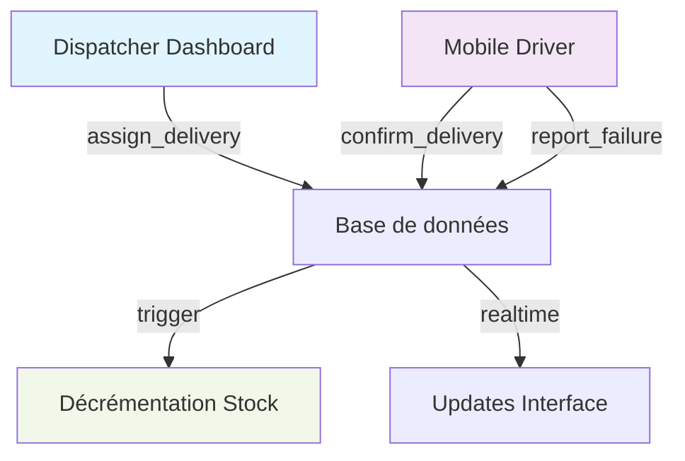

# Plan d'implémentation - Bloc 3 : Dispatch + Livraisons

## État actuel
✅ **Bloc 2 (CRM + Commandes) complété**
- RPC create_order_with_stock_check implémentée
- Interface CreateOrderForm fonctionnelle
- Page liste des commandes avec filtres avancés
- Contraintes de transition d'état pour les commandes
- Table tenant_settings avec seuils opérationnels

✅ **Infrastructure Bloc 3 déjà en place**
- Tables `deliveries` et `cash_collections` créées
- RLS policies pour livreurs et dispatchers
- Trigger de synchronisation statut commande/livraison
- Index de performance

## Prochaines étapes - Bloc 3 : Dispatch + Livraisons

### 🗂️ TG3.1 - RPC de gestion des livraisons
```sql
-- RPC assign_delivery(order_id, driver_id)
-- RPC confirm_delivery(delivery_id, collected_amount)
-- RPC report_failure(delivery_id, reason)
```

### 🎨 TG3.2 - Interface dispatcher
- Page `/dispatch` avec drag & drop des commandes
- Liste des livreurs disponibles avec statut en temps réel
- Carte géographique des livraisons (si données GPS disponibles)
- Assignation visuelle des commandes aux livreurs

### 📱 TG3.3 - Interface mobile livreur
- Page `/driver/deliveries` (mobile-first design)
- Liste des livraisons assignées avec statut
- Actions en 2 taps max : confirmer, échec, reprogrammer
- Formulaire de collecte cash avec calcul automatique
- Interface optimisée pour usage terrain

### ⚡ TG3.4 - Déclencheurs automatiques
- Trigger `after_delivery_confirmed` → décrémentation stock
- Synchronisation en temps réel des statuts
- Notifications push pour les nouvelles assignations

### 🧪 TG3.5 - Tests E2E
- Scénario complet : assignation → livraison → échec → reprogrammation
- Tests de performance mobile
- Validation des règles métier R-LIV

## Architecture technique



## Priorités d'implémentation

1. **RPC critiques** - `assign_delivery`, `confirm_delivery`, `report_failure`
2. **Interface dispatcher** - Page `/dispatch` avec gestion visuelle
3. **Interface mobile** - Page `/driver/deliveries` optimisée mobile
4. **Triggers automatiques** - Décrémentation stock et synchronisation
5. **Tests E2E** - Validation du flux complet

## Critère de succès Bloc 3
- Un livreur peut voir ses livraisons sur mobile
- Le dispatcher peut assigner visuellement des commandes
- La confirmation de livraison décrémente automatiquement le stock
- Les échecs de livraison sont tracés et peuvent être reprogrammés
- Toutes les règles métier R-LIV sont respectées

## Dépendances
- ✅ Bloc 2 complété (commandes et stock)
- ✅ Infrastructure livraisons déjà en place
- 🚀 Prêt pour le Bloc 4 (Cash + Dépôts)